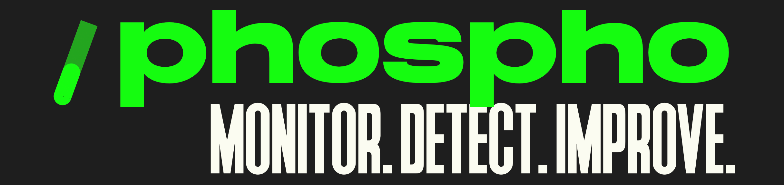

# The LLM app backoffice for busy builders

<div align="center">

<a href="https://www.npmjs.com/package/phospho"></a>
<a href="https://pypi.python.org/pypi/phospho"></a>
<a href="https://www.ycombinator.com/companies/phospho"></a>
<a href="https://pypi.org/project/phospho/" target="_blank"></a>
</div>

🧪 **phospho** is the **backoffice for your LLM app.**

Detect issues and extract insights from your users' text messages.

Gather feedback and measure success. Create the best conversational experience for your users.
Analyze logs effortlessly and finally make sense of all your data.

Learn more in the [documentation](https://docs.phospho.ai/welcome).

<div align="center">

</div>

## Demo 🧪

https://github.com/phospho-app/phospho/assets/66426745/5422d3b5-4f78-4445-be72-ff51eba26efb

## Key Features 🚀

- **Clustering**: Group similar conversations and identify patterns
- **A/B Testing**: Compare different versions of your LLM app
- **Data Labeling**: Efficiently categorize and annotate your data
- **User Analytics**: Gain insights into user behavior and preferences
- **Integration**: Sync data with LangSmith/Langfuse, Argilla, PowerBI
- **Data Visualization**: Powerful tools to understand your data
- **Multi-user Experience**: Collaborate with your team seamlessly

## Access the hosted version

Quickly import, analyze and label data on the [phospho platform](https://phospho.ai).

1. Create an [account](https://phospho.ai)
2. Install our SDK:

- Python: `pip install phospho`
- JavaScript: `npm i phospho`

3. Set environment variables ( you can find these on your phospho account )

- `PHOSPHO_API_KEY`
- `PHOSPHO_PROJECT_ID`

4. Initialize phospho: `phospho.init()`
5. Start logging to phospho with `phospho.log(input="question", output="answer")`

[Follow this guide to get started.](https://docs.phospho.ai/getting-started)

**Note:**

- You can also import data directly through a CSV or Excel directly on the platform
- If you use the python version, you might want to disable auto-logging with `phospho.init(auto_log=False)`

## Use phospho as a white label solution

Want to get the hosted version of phospho as a white label platform?

Contact us [here](mailto:contact@phospho.ai?subject=[GitHub]%20phospho%20white%label) to get your own white label backoffice for your llm apps.

## License

This project is licensed under the Apache 2.0 License - see the [LICENSE file](./LICENCE) for details

## Related projects

- [chatbot template streamlit OpenAI](https://github.com/phospho-app/template-chatbot-streamlit-openai)
- [phospho Javascript client](https://github.com/phospho-app/phosphojs)
- [phospho UI React components for user feedback](https://github.com/phospho-app/phospho-ui-react)

## Contributing

We welcome contributions from the community. Please refer to our [contributing guidelines](./CONTRIBUTE.md) for more information.

## About us

We are a team of passionate AI builders, feel free to reach out [here](mailto:contact@phospho.ai?subject=Hey%20baguettes)

_With love and baguettes from Paris, the phospho team 🥖💚_

## Star History

[](https://star-history.com/#phospho-app/phospho&Date)

## Installation

### Requirements

This project uses Poetry, Python3.11+ and Node/npm/NextJS for the frontend.

1. **Create a Virtual Environment and install dependencies**  
   Run the following commands to create a virtual environment and install dependencies
   phospho depends on different services which you need to install dependencies for

```bash
# 1 - Start at the root of the project and create a virtual environment
python -m venv .venv
# 2 - Install dependencies following with backend
cd ../backend
poetry install
# 3 - Install dependencies following with extractor
cd ../extractor
poetry install
# 4 - Install dependencies following up with ai-hub
cd ../ai-hub
poetry install
# 5 - Finish up by installing the frontend in /platform
cd ../platform
npm i # You might need to install Node and npm for this step
```

2. **Run the phospho Platform**
   To run the phospho platform locally, you will need to run these 4 services:

   - **Backend**: More information in `README.md`
   - **AI Hub**: More information in `README.md`
   - **Frontend**: More information in `README.md`
