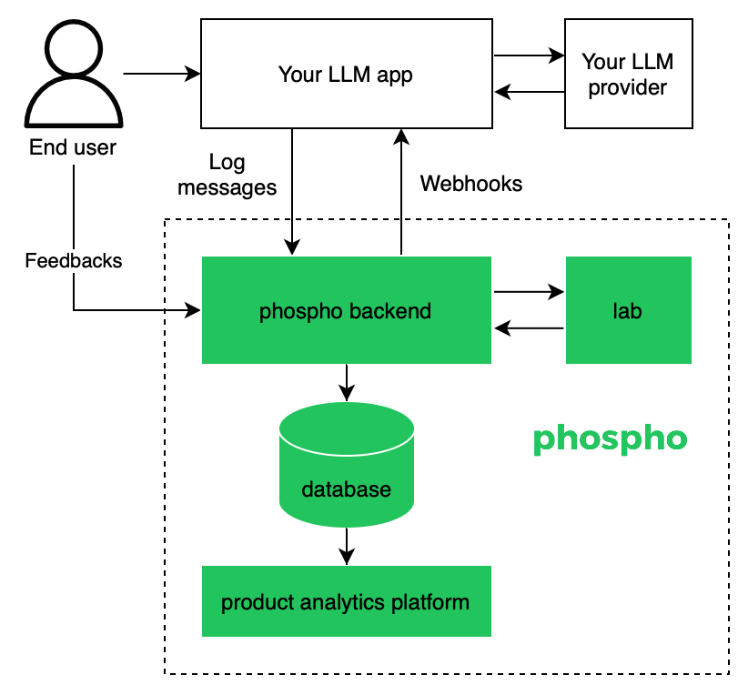

# phospho: Text Analytics Platform for LLM Apps

<div align="center">

<a href="https://www.npmjs.com/package/phospho"></a>
<a href="https://pypi.python.org/pypi/phospho"></a>
<a href="https://www.ycombinator.com/companies/phospho"></a>
</div>

<div align="center">
<a href="https://discord.gg/m8wzBGQA55"></a>
</div>

Phospho is the text analytics platform for LLM apps. Detect issues and extract insights from text messages of your users or your app. Gather user feedback and measure success. Iterate on your app to create the best conversational experience for your users.

Ship your LLM app in production with confidence, and iterate on it with insights from your users.

## Key Features

- Flexible logging
- Automatic evaluation
- Insights extraction
- Data visualization
- Collaboration

<div align="center">

</div>

## Demo

https://github.com/phospho-app/phospho/assets/78322686/fb1379bf-32f1-492e-be86-d29879056dc3

## Quickstart: Discover the phospho lab in pure python

The phospho lab is the core analytics component of phospho. The phospho lab helps you run batched evaluations and event detections on your messages.

```bash
pip install "phospho[lab]"
```

Follow the quickstart [here](https://docs.phospho.ai/local/quickstart).

## Self deploy

This repository contains the implementation of the platform frontend, the API backend, and the insights extraction pipeline.

- `phospho-python`: Python client with analytics engine
- `extractor`: FastAPI analytics service wrapping the analytics engine
- `backend`: FastAPI backend
- `platform`: NextJS frontend
- `internal-tools`: Platform management tools

### Prerequisites

Ensure you have the following installed:

- Docker
- Docker Compose

### 60 seconds deploy

1. Clone the repo:

```bash
git clone git@github.com:phospho-app/phospho.git && cd phospho
```

2. Register to the core external services:

- [OpenAI](https://platform.openai.com) (or another OpenAI-compatible model provider)
- [Cohere](https://cohere.com) (the free developer tier is enough for testing purposes)
- [Propelauth](https://www.propelauth.com) (the free tier is enough for testing purposes)

3. Copy the `.env.example` files into `.env.docker` files

```bash
cp backend/.env.example backend/.env.docker
cp platform/.env.example platform/.env.docker
cp extractor/.env.example extractor/.env.docker
```

4. Update the `.env.docker` files

```bash
vim backend/.env.docker # or emacs or vscode or nano
vim platform/.env.docker
vim extractor/.env.docker
```

5. Launch the project.

```bash
docker-compose up
```

6. Start using phospho

Go the platform at `http://localhost:3000` to grab your project id and api key.
Log your first message :

```bash
export PHOSPHO_PROJECT_ID="your_project_id"
export PHOSPHO_API_KEY="your_api_key"
curl -X POST "http://localhost:80/v2/log/$PHOSPHO_PROJECT_ID" -H "Authorization: Bearer $PHOSPHO_API_KEY" -H "Content-Type: application/json" -d '{"batched_log_events": [{"input": Hi, I just logged my first task to phospho!","output": "Congrats! Keep pushing!"}]}'
```

Don't forget to specify your backend url when you use the client libraries in your app. By default it's `http://localhost:80`

## Access the hosted version

To manage the phospho lab evaluations on a collaborative platform, the easiest way is to register to the hosted version.

1. Create a [phospho account](https://phospho.ai)
2. Install a phospho client: `pip install phospho` or `npm i phospho`
3. Create environment variables for `PHOSPHO_API_KEY` and `PHOSPHO_PROJECT_ID`
4. Initialize phospho: `phospho.init()`
5. Log to phospho with `phospho.log(input="question", output="answer")`

[Follow this guide to get started.](https://docs.phospho.ai/getting-started)

## Licence

This project is licensed under the Apache 2.0 License - see the [LICENSE file](./LICENCE) for details

## Related projects

- [phospho Javascript client](https://github.com/phospho-app/phosphojs)
- [phospho UI React components](https://github.com/phospho-app/phospho-ui-react)
- [phospho fastassert constrained inference](https://github.com/phospho-app/fastassert)
