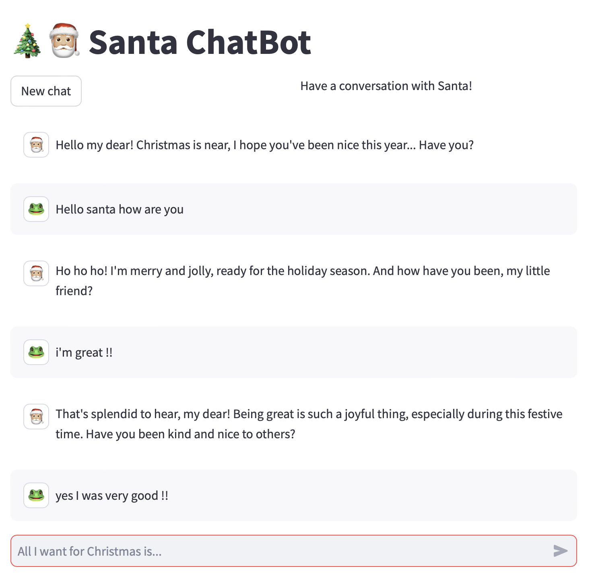
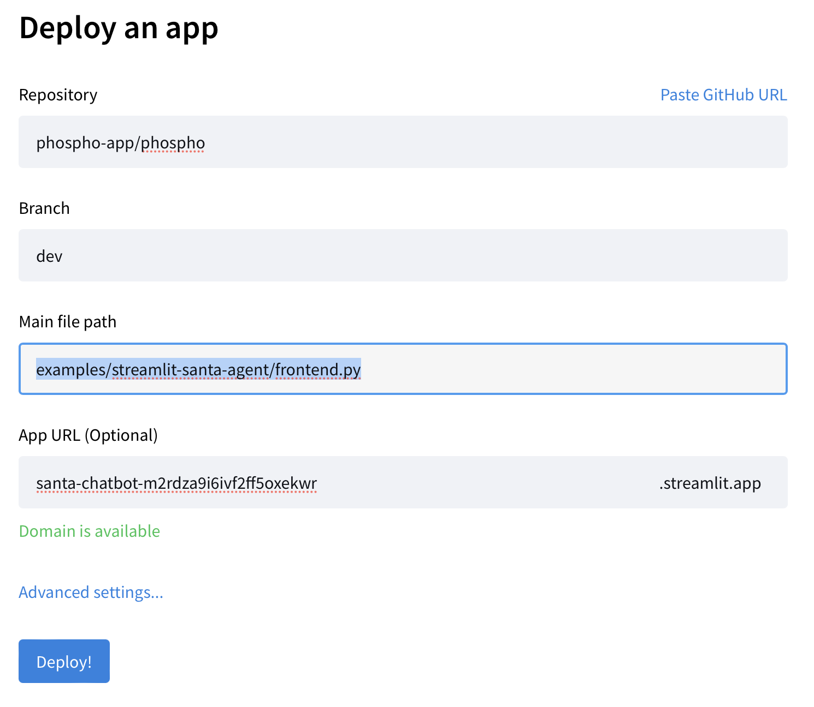
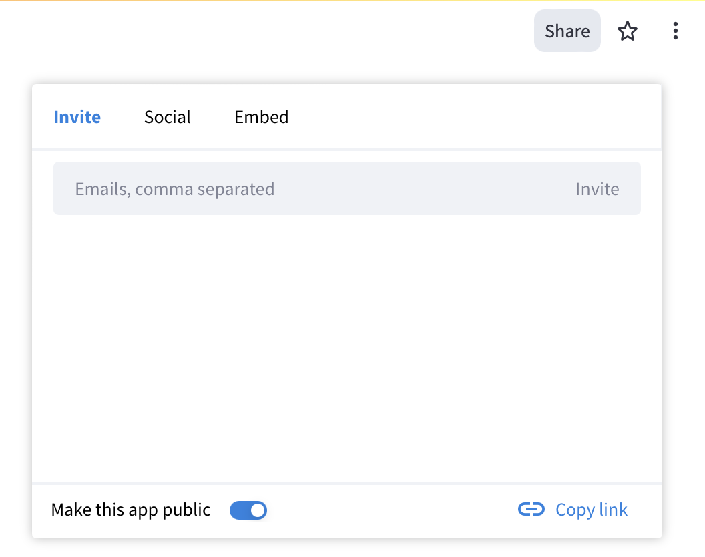
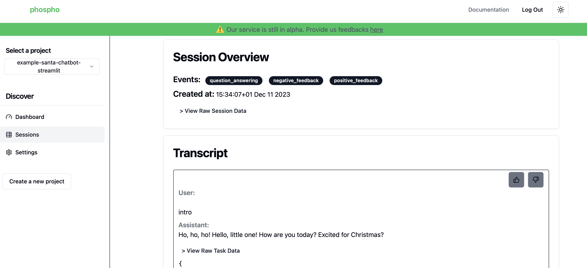

# Streamlit + phospho example

This is an example of a simple Santa Claus chatbot, implemented with phospho and streamlit.

[--> Click here to chat now with Santa Claus!](https://santa-chatbot-phospho.streamlit.app)



# Deploy your own version of the Santa chatbot

The goal of this chatbot is to show how you can use phospho to monitor the user interactions with your chatbot. 

## Local deployment

Create `secrets.toml` in the `.streamlit` folder. 

```toml
OPENAI_API_KEY=...
PHOSPHO_PROJECT_ID=...
PHOSPHO_API_KEY=...
```

You need an OpenAI key and a phospho account. 

Run the frontend the following way:

```bash
cd streamlit-agent # Make sure you are in this repository
streamlit run frontend.py
```

## Deploy on Streamlit Community Cloud 

The easiest way to deploy the chatbot on internet is with Streamlit Community Cloud.

### Setup Streamlit

Fork the [phospho repository](https://github.com/phospho-app/phospho) while connected to your github account.

Login or register to [Streamlit share](https://share.streamlit.io) with the same github account

On Streamlit share, click on "New App".


In the form, select your fork of the phospho repo. If you don't see the repo in the list, you can paste the URL. 

In the main file path, enter `examples/streamlit-santa-agent/frontend.py`



Click on _Advanced Settings_, and add the content of the `secrets.toml` file:

```toml
OPENAI_API_KEY=...
PHOSPHO_PROJECT_ID=...
PHOSPHO_API_KEY=...
```


Hit Save, and click deploy. Streamlit will now deploy your app on internet. Once it's done, click on the _Share button_ on the top-right to share your Santa Claus chatbot. 



Have a chat with your agent!

### Monitor your app

Once people have talked to your agent, go to your [phospho dashboard](https://platform.phospho.app) to see the analysis phospho made of your conversation. 



[Read the docs](https://docs.phospho.app) to learn more about how the phospho platform can help you monitor your agents!

## Get in touch

We are a team of AI builders enabling observability for LLM-apps at any scale. 

Feel free to reach out to *contact@phospho.app* for technical questions, job opportunities, and anything else.

We are also on [Discord](https://discord.gg/wk4uBSnKyW). Come and chat with the community!